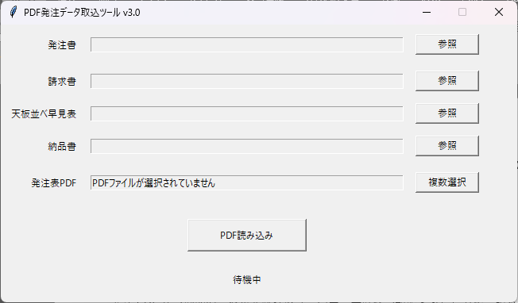
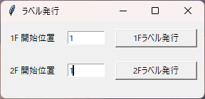

# PDF発注データ取込ツール

## 概要

発注書PDFから商品名・数量を自動で読み取り、5営業所分の注文データを集計表へ転記するWindows向け業務支援ツールです。

集計結果をもとに、以下の帳票も自動作成します。

- 請求書
- 天板並べ早見表
- 納品書
- 1F / 2F ラベルPDF

PDF解析・Excel転記・帳票生成・ラベルPDF生成までの定型作業を自動化します。

---

## 主な機能

- 複数の発注書PDFを一括読み込み
- PDFから商品名・数量・納品日を取得
- 商品名の表記ゆれを登録済みルールに基づいて補正
- 営業所ごとの注文数を集計
- 集計表を納品日付きの別ファイルとして生成
- 請求書へ営業所ごとの金額を転記
- 天板並べ早見表へ数量を転記
- 納品書へ商品名・受注数・箱数を転記
- 1F / 2F のラベルPDFを生成
- 入力テンプレートを上書きせず、生成物を `output/` に保存
- `pytest` による自動テスト
- GUIを介さず実ファイルを使用して検証できる手動実機テスト

---

## 動作イメージ

### メイン画面



### ラベルPDF生成



---

## 動作環境

- Windows 10 / Windows 11
- Python 3.14系
- Microsoft Excel
- Tkinter
- `openpyxl`
- `pywin32`

※Excel VBAやExcel本体によるイベント処理が必要なファイルではMicrosoft Excelを使用します。

---

## プロジェクト構成

```text
PdfOrderImporter/
├─ output/
├─ sample/
├─ src/
│  ├─ config/
│  ├─ constants/
│  ├─ excel/
│  ├─ models/
│  ├─ pdf/
│  ├─ services/
│  ├─ utils/
│  ├─ gui.py
│  └─ main.py
├─ templates/
│  ├─ 集計表.xlsx
│  ├─ 請求書.xlsx
│  ├─ 天板並べ早見表.xlsm
│  └─ 納品書.xlsx
├─ tests/
│  ├─ manual/
│  │  └─ test_real_conversion.py
│  └─ ...
└─ README.md
```

`output/` は生成物専用ディレクトリで、Git管理対象外です。

---

## 処理フロー

```text
発注書PDF
   │
   ▼
PDF解析
   │
   ├─ 納品日
   ├─ 営業所
   ├─ 商品名
   └─ 注文数
   │
   ▼
商品名検証・表記ゆれ補正
   │
   ▼
営業所別注文データ
   │
   ▼
集計表生成
   │
   ├──────────────┬──────────────┐
   ▼              ▼              ▼
請求書         天板並べ早見表      納品書
   │              │              │
   ├──────────────┘──────────────┘
   │
   ▼
ラベルPDF生成
   │
   ▼
output/
```

---

## 使用方法

### 1. PDFファイルを準備

処理対象となる発注書PDFを用意します。

PDFファイル名は、以下の形式を想定しています。

```text
YYMMDD営業所名（任意）.pdf
```

複数のPDFを同時に処理する場合、すべて同じ納品日である必要があります。

### 2. 入力ファイルを準備

以下のテンプレートファイルを使用します。

- 集計表
- 請求書
- 天板並べ早見表
- 納品書

実際の業務では、納品時に提供されたテンプレートを指定して使用します。

### 3. GUIから実行

アプリを起動し、必要なExcelファイルと発注PDFを指定して処理を実行します。

処理完了後、集計表・請求書・天板並べ早見表・納品書が生成され、必要に応じてラベルPDFを発行できます。

---

## 出力ファイル

すべての生成物は `output/` に保存されます。

例：

```text
output/
├─ 集計表_20260922.xlsx
├─ 請求書_20260922.xlsx
├─ 天板並べ早見表_20260922.xlsm
├─ 納品書_20260922.xlsx
└─ ラベル_1F_20260922.pdf
```

入力テンプレートは上書きしません。

---

## 商品マスタ

商品情報は集計表の「商品マスタ」シートを基準として処理します。

主に以下の情報を使用します。

- 商品名
- 1箱当たりの入数
- ラベル包装階
- 注文数倍数
- 店売り数
- 単価
- 限界利益単価

PDFの商品名は商品マスタと照合して処理します。登録済みの商品名エイリアスについては表記ゆれを補正します。

---

## 店売り数

店売り数は集計表の「天板換算表」から読み込み、天板並べ早見表へ反映します。

推奨手順：

1. 集計表の店売り数を更新
2. 発注書PDFを準備
3. アプリを実行
4. `output/` の生成ファイルを確認

---

## テスト

### 自動テスト

プロジェクトルートで以下を実行します。

```powershell
pytest
```

PDF解析、商品マスタ、Excel転記、ラベル生成などの各機能をテストします。

### 実機テスト

GUIを介さず、実際のPDF・Excelファイルを使用して一連の処理を確認できます。

```powershell
python tests/manual/test_real_conversion.py
```

実機テストでは以下を確認します。

- PDF読み込み
- 集計表生成
- 請求書転記
- 天板並べ早見表転記
- 納品書転記
- ラベルPDF生成

生成されたファイルは `output/` で確認できます。

---

## 設計上のポイント

### 入力ファイルを上書きしない

処理対象となるテンプレートを直接変更せず、出力先へコピーしてから転記します。

```text
templates/
    ↓
処理
    ↓
output/
```

### Excel COMの利用

天板並べ早見表など、Excelの `Worksheet_Change` イベントやVBA処理を必要とするファイルでは、`openpyxl` に加えてExcel COMを利用します。

### 処理ロジックとGUIの分離

主要な処理は `src.main.run_conversion()` に集約し、GUIからも手動実機テストからも同じ処理ロジックを呼び出せる構成としています。

---

## 注意事項

- 処理対象のExcelファイルは、原則としてExcelで開いていない状態で実行してください。
- Excel COMを使用する処理では、Microsoft Excelがインストールされている必要があります。
- `output/` は生成物を保存するためのディレクトリであり、Git管理対象外です。
- 実際の業務データや個人情報をリポジトリへ登録しないでください。
- GitHub公開時には、実際の帳票・発注書・顧客情報などをサンプルデータへ置き換えてください。

---

## ポートフォリオ公開について

本リポジトリは、PDF発注データを起点としたExcel帳票作成業務を自動化した開発事例として公開しています。

実運用で使用する帳票やデータそのものは公開せず、匿名化・サンプル化したデータを使用しています。

主な技術要素：

- Python
- PDF解析
- Excel自動操作
- `openpyxl`
- `pywin32`
- Tkinter
- pytest
- ファイル入出力
- データ検証
- Excel VBA連携

---

## 開発履歴

### Development Version

- 複数PDF対応
- 商品名表記ゆれ対応
- 営業所自動判定
- 納品日自動入力
- 請求書自動転記
- 天板並べ早見表自動転記
- 納品書自動転記
- ラベル発行機能
- GUIからのファイル選択
- 設定ファイルによる入力内容保存

### Portfolio version

- 実データを匿名化・サンプルデータへ置換
- 入力テンプレートと出力ファイルを分離
- 生成物を `output/` に集約
- `output/` をGit管理対象外へ変更
- 自動テストを整理
- GUIを介さない実機テストを追加
- 集計表・請求書・天板並べ早見表・納品書・ラベルPDFの一連の処理を同一の変換処理から実行可能に整理
